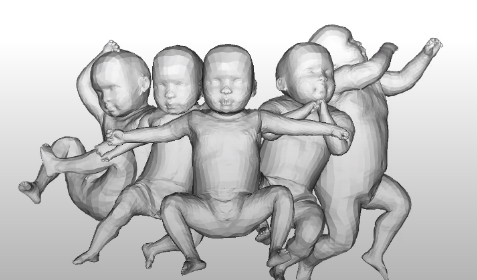

# SMIL

SMIL stands for **Skinned Multi-Infant Linear Model**. Based on SMPL, the model is adapted for infant body shapes and poses. This realistic, data-driven body model allows accurate capture of shape and 3D body motion of freely moving infants.

*Example of RGB
input image and the result of SMIL registered to the data.*

Since the model is based on SMPL, it can be readily integrated into animation and fitting processes. New infant body space is computed from a large data of infant RGB-D scans from ~200K frames. SMIL faithfully represents poses and shapes of infants and captures enough information to allow medical assessments such as *General Movement Assessment* (GMA). 

Quantitatively, SMIL's metric accuracy is *~ 2.5 mm*.

# Source Code

- [Commericial License](#)

# Resources

[Paper](http://files.is.tue.mpg.de/black/papers/miccai18.pdf)

[Project Video](https://youtu.be/aahF1xGurmM)

