**SMPL: A Skinned Multi-Person Linear Model** is a realistic 3D model of the human body that is based on skinning and blend shapes and is learned from thousands of 3D body scans. 

The human body is certainly central to our lives and is commonly depicted in images and video. We are developing the world's most realistic models of the body by learning their shape and how they move from data.  Our goal is to make 3D models of the body look and move in ways that make them indistinguishable from real humans.  Such virtual humans can be used in special effects and will play an important role in emerging virtual reality systems. They can also be used in computer vision to generate training data for learning methods or can be fit directly to sensor data. What makes this hard is that the human body is highly articulated, deforms with kinematic changes, and exhibits large shape variability across subjects. 

SMPL makes the human body model as simple and standard as possible. The simplicity of our formulation means that SMPL can be trained from large amounts of data. On top of that, with the low polygon count, a simple vertex topology (for both men and women models), a clean quad structure, and a standard rig, SMPL makes a realistic learned model accessible to animators as well as computer vision researchers. That means, SMPL model can realistically represent a wide range of human body shapes, can be posed with natural pose-dependent deformations, exhibits soft-tissue dynamics, is efficient to animate, and is compatible with existing rendering engines. 


# Definition
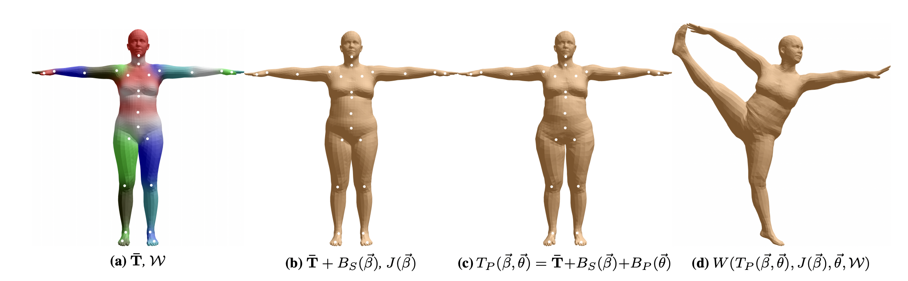
*SMPL model. (a) Template mesh with blend weights indicated by color and joints shown in white. (b) With identity-driven blendshape contribution only; vertex and joint locations are linear in shape vector ~. (c) With the addition of of pose blend shapes in preparation for the split pose; note the expansion of the hips. (d) Deformed vertices reposed by dual quaternion skinning for the split pose.*

The SMPL model decomposes body shape into identity-dependent shape and non-rigid pose-dependent shape. We take a vertex-based skinning approach that uses corrective blend shapes. A single blend shape is represented as a vector of concatenated vertex offsets. We begin with an artist created rigged mesh with `N = 6890` vertices and `K = 23` joints. The mesh has the same topology for men and women, spatially varying resolution, a clean quad structure, a segmentation into parts, initial blend weights, and a skeletal rig. These components are further defined below:	

## Template Mesh `T`
A 3D mesh that defines the 3D topology (e.g. number of vertices, polygons, skeleton joints) used by the SMPL-Model.

## Shape Components `ß` 
Identity-dependent mesh surface descriptors represented as vectors of concatenated vertex offsets from the Template Mesh. Consider these as an array of deltas that can be added as a layer on top of the template shape mesh `(T + ß)` in order to create different human bodies of varying body shape. Essentially, this layer can create different, realistic human identities. Typically the SMPL body models contain up to 300 shape components, but with just 10 shape components, the majority of variation due to body shape changes, like height, weight, waist size, shoulder breadth, etc. can be observed. Using more components provides a more granular control over specific body features, creating dimples, skin folds and facial feature variations.    

## Pose Components `θ`
Pose-dependent mesh surface descriptors represented as vectors of concatenated vertex offsets from the Template Mesh. Consider these as another array of deltas that can be added as a layer on top of the template shape and the shape components `(T + ß + θ)` in order to represent the muscle-based deformations produced on our bodies whenever we rotate any joints. For example, this layer will create the bulging effect around the elbows of the 3D body whenever the elbows of the template mesh are folded in.

## Dynamics Components `φ`
Soft-tissue-dependent mesh surface descriptors represented as vectors of concatenated vertex offsets from the Template Mesh. Consider these as another array of deltas that can be added as a layer on top of the other layers `(T + ß + θ + φ)` in order to represent the soft-tissue deformations produced during fast motions, such as the jiggling of fat-tissue during running.

## Model Software
This is the core software to provide functionality to load the model components, and a parametric function that uses these components to generate 3D human meshes with varying identities in different poses.


# Related Models: The SMPL Family 
The formulation of the SMPL model has given rise to much research and further development of related models that use the same formulation to create a new model to focus on specific segments of the body (e.g. hands, faces), or to represent a new body type (infants), or even to create a similar representation for animals. 

## SMIL
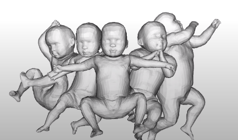

[SMIL](https://ps.is.mpg.de/code/skinned-multi-infant-linear-model-smil) is the first work on 3D shape and 3D pose estimation of infants, as well as the first work on learning a statistical 3D body model from lowquality, incomplete RGB-D data of freely moving humans. It provides a fundamental tool that can form a component in a fully automatic system for the General Movement Assessment for early detection of neurodevelopmental disorders.

Other statistical body models within the SMPL family aim to describe the surface of humans or animals in a low-dimensional space. These on dense surface data captured from cooperative, easy-to-instruct subjects. Infants present a major challenge in terms of data acquisition as they are not cooperative and cannot be instructed. Unlike previous work on human body models, there are hardly any repositories of high quality scans of infants. Therefore, SMIL is a 3D body model learned from RGB-D sequences of freely moving infants.

## SMAL
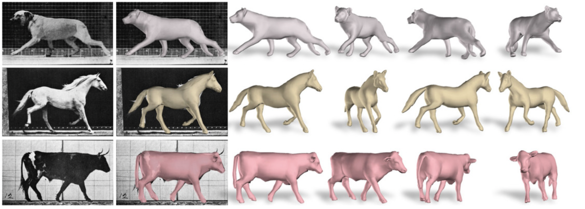

[SMAL](https://smal.is.tue.mpg.de/): Skinned Multi-Animal Linear Model of 3D Animal Shape, is a 3D articulated model that can represent animals including lions, tigers, horses, cows, hippos, dogs. 

While The SMPL model is learned from thousands of 3D scans of people in specific poses, this is infeasible with live animals. They are clearly much less cooperative than humans! SMAL introduces the idea to learn the model from a small set of 3D scans of toy figurines in arbitrary poses, including lions, cats, tigers, dogs, horses, cows, foxes, deers, zebras, and hippos. This approach requires new tools for aligning scans of animals with different shape and size to a common template. With the alignment to a common template we learn a shape space representing the training animals. New animal shapes can be sampled from the model, posed, animated, and fit to data.


## MANO and SMPL+H
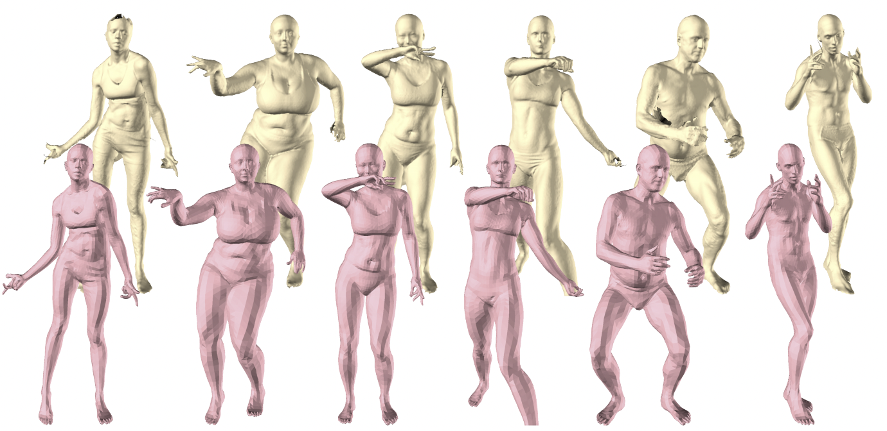

**MANO:** *Embodied Hands: Modeling and Capturing Hands and Bodies Together*

[MANO](https://mano.is.tue.mpg.de/) is created from the SMPL hand topology, and has analogous components to those in SMPL: a template shape, kinematic tree, shape and pose blend shapes, blend weights and a joint regressor.

Bodies and hands are literally inseparable. Yet, despite this, research on modeling bodies and hands has progressed separately. Significant advances have been made on learning realistic 3D statistical shape models of full bodies but these models typically have limited, or no, hand articulation. Similarly there is significant work on tracking hands using depth sensors and video sequences but these hands are modeled and tracked in isolation from the body. Hands and body together are important for communication and a complete picture of our actions, emotions, and intentions is not possible without the joint analysis of hands and bodies. The growth of interest in virtual and augmented reality has increased this need for characters and avatars that combine realistic bodies and hands in motion. MANO provides a new approach to capture the 4D motion of the hands and body together.

## FLAME
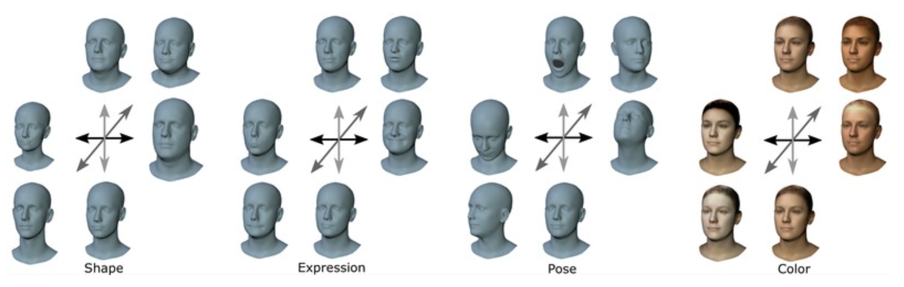

**FLAME model:** *variations for shape, expression, pose, and appearance. For shape, expression, and appearance variations, the first 3 principal components are visualized at ±3 standard deviations. The pose variations are visualized at ±π/6 (head pose) and 0,π/8 (jaw articulation).*

[FLAME](https://flame.is.tue.mpg.de/) adapts the SMPL body model formulation to create a statistical head model that is significantly more accurate and expressive than existing head and face models, while remaining compatible with standard graphics software. In contrast to existing models, FLAME explicitly models head pose and eyeball rotation.

There is a significant gap in the field of 3D face modeling. At one end of the spectrum are highly accurate, photo-realistic, 3D models of individuals that are learned from scans or images of that individual and/or involve significant input from a 3D artist. At the other end are simple generic face models that can be fit to images, video, or RGB-D data but that lack realism. What is missing are generic 3D face models that are compact, can be fit to data, capture realistic 3D face details, and enable animation. The goal of the FLAME model is to move the “low end” models towards the “high end” by learning a model of facial shape and expression from 4D scans (sequences of 3D scans).  

## SMPL-X
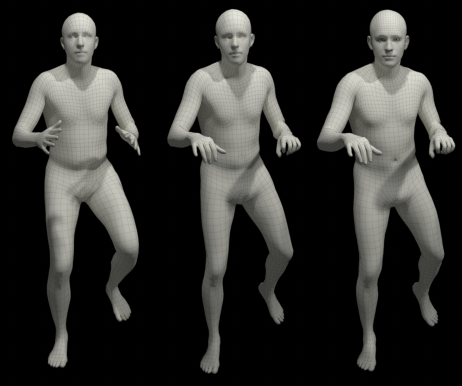

**SMPL vs SMPL+H vs SMPL-X:** *Comparison of SMPL (left), SMPL+H (middle) and SMPL-X (right). The results show a clear increase in expressiveness from let to right, as model gets richer from body-only (SMPL) to include hands (SMPL+H) or hands and face (SMPL-X)*

[SMPL-X](https://smpl-x.is.tue.mpg.de/) combines the developments from *SMPL, MANO and FLAME* models to create a unified model, called SMPL-X, for SMPL eXpressive, with shape parameters trained jointly for the face, hands and body.

Starting with an artist designed 3D template, whose face and hands match the templates of [FLAME](#FLAME) and [MANO](#MANO-and-SMPL+H), SMPl-X is learned from four datasets of 3D human scans. The shape space parameters, are trained on 3800 alignments in an A-pose capturing variations across identities. The body pose space parameters are trained on 1786 alignments in diverse poses. Since the full body scans have limited resolution for the hands and face, SMPL-X also leverages the parameters of MANO and FLAME, learned from 1500 hand and 3800 head high-resolution scans respectively. More specifically, SMPl-X uses the pose space and pose corrective blendshapes of MANO for the hands and the expression space E of FLAME

## STAR
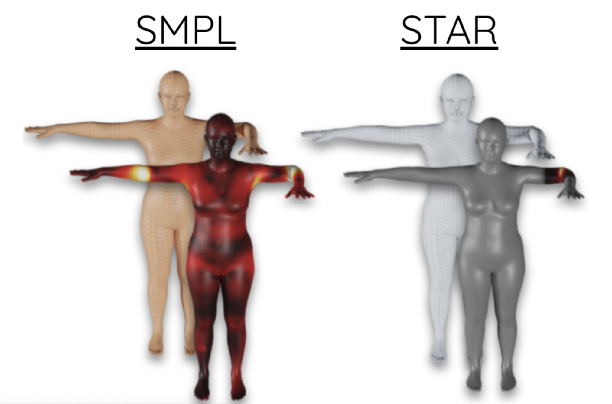

**SMPL vs STAR:** *Examples of some SMPL limitations. Heat maps illustrate the magnitude of the pose-corrective offsets highlighting the spurious long-range correlations learned by the SMPL pose corrective blend shapes. Bending one elbow results in a visible bulge in the other elbow.*

[STAR](https://star.is.tue.mpg.de/): Sparse Trained Articulated Regressor, is a new compact human body model that is more accurate than SMPL yet has sparse and spatially local blend shapes, such that a joint only influences a sparse set of vertices that are geodesically close to it. 

The original SMPL model has several limitations. First, SMPL has a huge number of parameters resulting from its use of global blend shapes. These dense pose-corrective offsets relate every vertex on the mesh to all the joints in the kinematic tree, capturing spurious long-range correlations. To address this, STAR introduces per-joint pose correctives and learns the subset of mesh vertices that are influenced by each joint movement. This sparse formulation results in more realistic deformations and significantly reduces the number of model parameters to 20% of SMPL. When trained on the same data as SMPL, STAR generalizes better despite having many fewer parameters. Second, SMPL factors pose-dependent deformations from body shape while, in reality, people with different shapes deform differently. Consequently, STAR presents shape-dependent posecorrective blend shapes that depend on both body pose and BMI. Third, the shape space of SMPL was trained on a much smaller training set of around 4000 subjects. So SMPL is not rich enough to capture the variation in the human population. STAR addresses this by training the shape space with an additional 10,000 scans of male and female subjects, and shows that this results in better model generalization. STAR is compact, generalizes better to new bodies and is a drop-in replacement for SMPL. 


# Download Models

## Academic Use
Each of the SMPL Model variants are freely available to download and use for academic purposes. You can find information for downloading the model and related code for each model at the respective academic page as listed below:

| **Model** | **Description**                                       | **Link**                     | 
|-----------|-------------------------------------------------------|----------------------------- |
| SMPL      | Human body model  (without hand and face articulation)| https://smpl.is.tue.mpg.de/  |
| SMPL+H    | Human body + hand model (without face articulation)   | https://mano.is.tue.mpg.de/  |
| MANO      | Hand model                                            | https://mano.is.tue.mpg.de/  |
| SMPL-X    | Human body + hand + face model                        | https://smpl-x.is.tue.mpg.de/|
| STAR      | Human body model (more compact & faster SMPL)         | https://star.is.tue.mpg.de/  |
| SMIL      | SMPL infant model                                     | https://ps.is.mpg.de/publications/hesse-micai-2018|
| SMAL      | SMPL animal model                                     | https://ps.is.mpg.de/code/smal |

 

## Commercial Use
For commercial use the SMPL model and body model variants can all be sublicensed through Meshcapade's licensing options listed here:

https://meshcapade.com/infopages/licensing.html
  
Meshcapade's commercial licensing for SMPL Model includes access to all all the adult model variants of SMPL (SMPL+H, SMPL-X, STAR), while the infant model [SMIL](#SMIL), and animal model [SMAL](#SMAL) are expected to be available as separate licenses soon!  
 

# Model Tools

## Mesh Templates & Samples
You can find various samples of template meshes, animated outputs and textures for the SMPL and related models below.

### Sample OBJs with textures
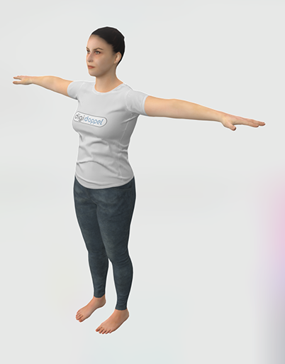 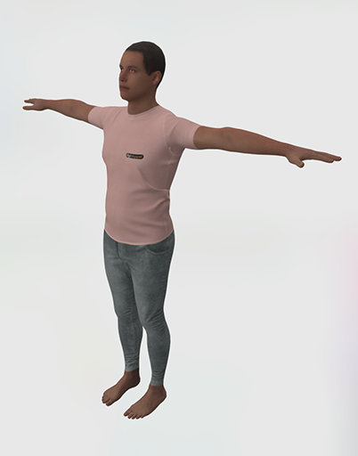 
    
a) **[Sample texture with SMPL topology](https://app.box.com/s/mdx2m368j9m0jgkkjnf67l6blrwrt20f)**:  
Made available under [CC-BY 4.0](https://creativecommons.org/licenses/by/4.0/) License. Male & Female models in OBJ format, with sample textures. These samples represent the mesh topology used in [SMPL](#SMPL), [SMPL+H](#MANO-and-SMPL+H) and [STAR](#STAR) models.
    
b) **[Sample texture with SMPL-X topology](https://app.box.com/s/ei0gk8295o3pu7qugrisgucnpfqoghsm)**:  
Made available under [CC-BY 4.0](https://creativecommons.org/licenses/by/4.0/) License. Male & Female models in OBJ format, with sample textures. These samples represent the mesh topology used in [SMPL-X](#SMPL-X) model.

### Sample FBX with animation

*[SMPL animated mesh with textures](https://app.box.com/s/732qw6hcxqnprdqeya2s8zcr6gzvw2ub)*
Rigged male SMPL model with default texture, animated using motion capture.

### Body-part segmentation

a) **[SMPL part segmentation](../assets/SMPL_body_segmentation/smpl/smpl_vert_segmentation.json)**
This body-part segmentation defines part segmentation information for SMPL, SMPL+H and STAR models.

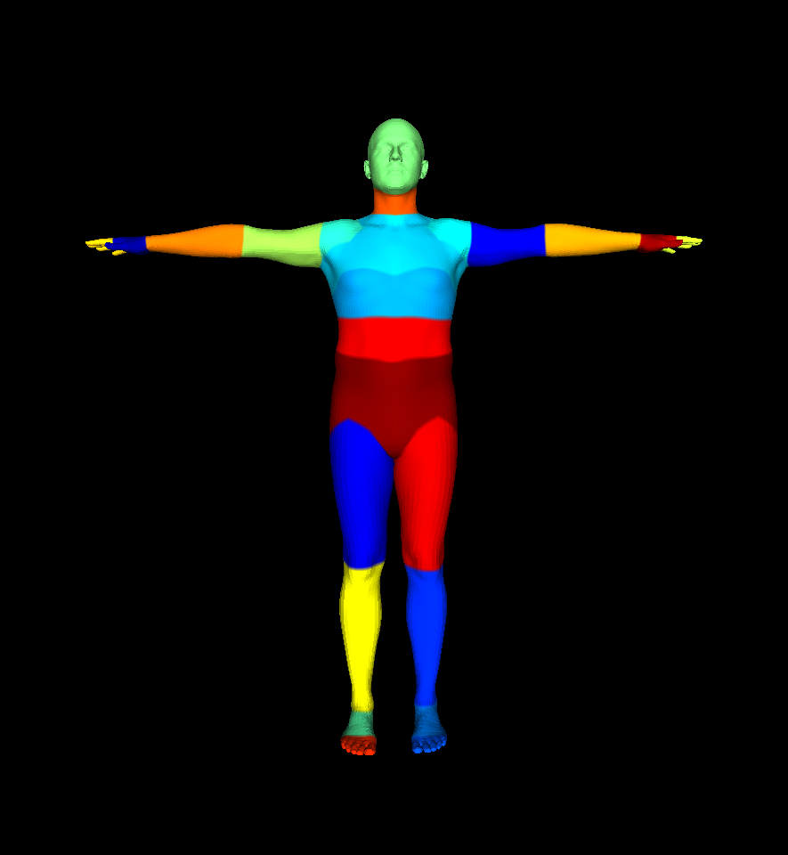


b) **[SMPL-X part segmentation](../assets/SMPL_body_segmentation/smplx/smplx_vert_segmentation.json)**
This body-part segmentation defines part segmentation information for only the SMPL-X model.

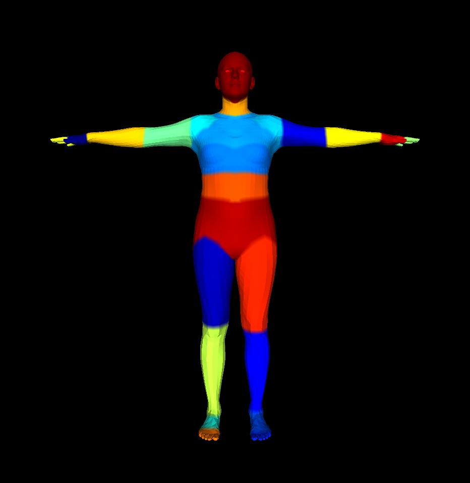

### Skeleton layout

The SMPL model's pose parameters in the python model files are defined in Rodrigues formulation. Each triplet of pose-parameters corresponds to one skeleton joint. The joint-name for each pose-parameter-triplet is defined in the mapping below for all 3 variations of the SMPL model. Note that these layouts also show the kinematic tree of the model as used in the SMPL FBX files.


a) **SMPL skeleton**:

```
     0: 'pelvis',
     1: 'left_hip',
     2: 'right_hip',
     3: 'spine1',
     4: 'left_knee',
     5: 'right_knee',
     6: 'spine2',
     7: 'left_ankle',
     8: 'right_ankle',
     9: 'spine3',
    10: 'left_foot',
    11: 'right_foot',
    12: 'neck',
    13: 'left_collar',
    14: 'right_collar',
    15: 'head',
    16: 'left_shoulder',
    17: 'right_shoulder',
    18: 'left_elbow',
    19: 'right_elbow',
    20: 'left_wrist',
    21: 'right_wrist',
    22: 'left_hand',
    23: 'right_hand'
```

b) **SMPL-H skeleton**:

```
     0: 'pelvis',
     1: 'left_hip',
     2: 'right_hip',
     3: 'spine1',
     4: 'left_knee',
     5: 'right_knee',
     6: 'spine2',
     7: 'left_ankle',
     8: 'right_ankle',
     9: 'spine3',
    10: 'left_foot',
    11: 'right_foot',
    12: 'neck',
    13: 'left_collar',
    14: 'right_collar',
    15: 'head',
    16: 'left_shoulder',
    17: 'right_shoulder',
    18: 'left_elbow',
    19: 'right_elbow',
    20: 'left_wrist',
    21: 'right_wrist',
    22: 'left_index1',
    23: 'left_index2',
    24: 'left_index3',
    25: 'left_middle1',
    26: 'left_middle2',
    27: 'left_middle3',
    28: 'left_pinky1',
    29: 'left_pinky2',
    30: 'left_pinky3',
    31: 'left_ring1',
    32: 'left_ring2',
    33: 'left_ring3',
    34: 'left_thumb1',
    35: 'left_thumb2',
    36: 'left_thumb3',
    37: 'right_index1',
    38: 'right_index2',
    39: 'right_index3',
    40: 'right_middle1',
    41: 'right_middle2',
    42: 'right_middle3',
    43: 'right_pinky1',
    44: 'right_pinky2',
    45: 'right_pinky3',
    46: 'right_ring1',
    47: 'right_ring2',
    48: 'right_ring3',
    49: 'right_thumb1',
    50: 'right_thumb2',
    51: 'right_thumb3'
```

c) **SMPL-X skeleton**:

```
     0: 'pelvis',
     1: 'left_hip',
     2: 'right_hip',
     3: 'spine1',
     4: 'left_knee',
     5: 'right_knee',
     6: 'spine2',
     7: 'left_ankle',
     8: 'right_ankle',
     9: 'spine3',
    10: 'left_foot',
    11: 'right_foot',
    12: 'neck',
    13: 'left_collar',
    14: 'right_collar',
    15: 'head',
    16: 'left_shoulder',
    17: 'right_shoulder',
    18: 'left_elbow',
    19: 'right_elbow',
    20: 'left_wrist',
    21: 'right_wrist',
    22: 'jaw',
    23: 'left_eye',
    24: 'right_eye',
    25: 'left_index1',
    26: 'left_index2',
    27: 'left_index3',
    28: 'left_middle1',
    29: 'left_middle2',
    30: 'left_middle3',
    31: 'left_pinky1',
    32: 'left_pinky2',
    33: 'left_pinky3',
    34: 'left_ring1',
    35: 'left_ring2',
    36: 'left_ring3',
    37: 'left_thumb1',
    38: 'left_thumb2',
    39: 'left_thumb3',
    40: 'right_index1',
    41: 'right_index2',
    42: 'right_index3',
    43: 'right_middle1',
    44: 'right_middle2',
    45: 'right_middle3',
    46: 'right_pinky1',
    47: 'right_pinky2',
    48: 'right_pinky3',
    49: 'right_ring1',
    50: 'right_ring2',
    51: 'right_ring3',
    52: 'right_thumb1',
    53: 'right_thumb2',
    54: 'right_thumb3'
```

d) **SUPR skeleton**:
```
    0: 'pelvis',
    1: 'left_hip',
    2: 'right_hip',
    3: 'spine1',
    4: 'left_knee',
    5: 'right_knee',
    6: 'spine2',
    7: 'left_ankle',
    8: 'right_ankle',
    9: 'spine3',
    10: 'left_foot',
    11: 'right_foot',
    12: 'neck',
    13: 'left_collar',
    14: 'right_collar',
    15: 'head',
    16: 'left_shoulder',
    17: 'right_shoulder',
    18: 'left_elbow',
    19: 'right_elbow',
    20: 'left_wrist',
    21: 'right_wrist',
    22: 'jaw',
    23: 'left_eye',
    24: 'right_eye',
    25: 'left_index1',
    26: 'left_index2',
    27: 'left_index3',
    28: 'left_middle1',
    29: 'left_middle2',
    30: 'left_middle3',
    31: 'left_pinky1',
    32: 'left_pinky2',
    33: 'left_pinky3',
    34: 'left_ring1',
    35: 'left_ring2',
    36: 'left_ring3',
    37: 'left_thumb1',
    38: 'left_thumb2',
    39: 'left_thumb3',
    40: 'right_index1',
    41: 'right_index2',
    42: 'right_index3',
    43: 'right_middle1',
    44: 'right_middle2',
    45: 'right_middle3',
    46: 'right_pinky1',
    47: 'right_pinky2',
    48: 'right_pinky3',
    49: 'right_ring1',
    50: 'right_ring2',
    51: 'right_ring3',
    52: 'right_thumb1',
    53: 'right_thumb2',
    54: 'right_thumb3',
    55: 'left_bigtoe1',
    56: 'left_bigtoe2',
    57: 'left_indextoe1',
    58: 'left_indextoe2',
    59: 'left_middletoe1',
    60: 'left_middletoe2',
    61: 'left_ringtoe1',
    62: 'left_ringtoe2',
    63: 'left_pinkytoe1',
    64: 'left_pinkytoe2',
    65: 'right_bigtoe1',
    66: 'right_bigtoe2',
    67: 'right_indextoe1',
    68: 'right_indextoe2',
    69: 'right_middletoe1',
    70: 'right_middletoe2',
    71: 'right_ringtoe1',
    72: 'right_ringtoe2',
    73: 'right_pinkytoe1',
    74: 'right_pinkytoe2'
```

>> Note: [digidoppel](https://digidoppel.com/) platform returns pose parameters in SMPLH format. 


### Using SMPL pose parameters 
To convert the SMPL pose parameters from Rodrigues triplets to rotation matrix notation (3x3 metrices), you can use OpenCV's method [cv.rodrigues()](https://docs.opencv.org/3.4/d9/d0c/group__calib3d.html#ga61585db663d9da06b68e70cfbf6a1eac).


## SMPL Software, Plugins & Scripts

### SMPL in Python 
* [SMPL, SMPL+H, SMPL-X](https://github.com/vchoutas/smplx)
* [STAR](https://github.com/ahmedosman/STAR)

### SMPL for Animation 
* [SMPL in Maya](https://github.com/Meshcapade/SMPL_maya_plugin)
* [SMPL in Blender](https://www.youtube.com/watch?v=DY2k29Jef94)
* [SMPL in Unity](https://app.box.com/s/31zc131kaql0epmi5012xlmyk4lwsbat)
* [SMPL in Unreal](https://www.youtube.com/watch?v=fuB4OWxOhME)

Also check out this video for more on SMPL in Blender, Unity and Unreal Engine:
[https://www.youtube.com/watch?v=m8i00zG6mZI](https://www.youtube.com/watch?v=m8i00zG6mZI)

### Inter-Model operability
* [MANO & FLAME correspondences](https://github.com/vchoutas/smplx#mano-and-flame-correspondences)
* [SMPL-SMPLX-STAR conversions](https://github.com/vchoutas/smplx/tree/master/transfer_model)
* [SMPLX OpenPose mapping](../assets/SMPLX_OpenPose_mapping/README.md)
    


