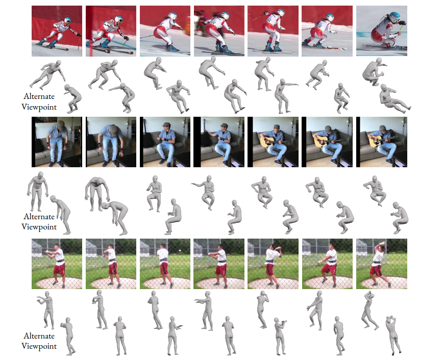

# VIBE

VIBE stands for **Video Inference for Body Pose and Shape Estimation**. It is a new video-based approach to 3D motion capture that makes the movements of virtual avatars more realistic.

Based on AMASS (citation needed) and together with unpaired, in-the-wild, 2D keypoint estimations, VIBE can not only estimate 3D human motion from a video sequence, but also able to distinguish between real and implausible movements including the way limbs and extremities move. The result is a fast, smooth, realistic prediction of human pose, shape, and motion over frames. 

While high-quality virtual movement has long been a fixture of animated film and video games, producing realistic human shapes and poses generally involves a great deal of handcrafting: annotating a few seconds of video takes graphic artists and technicians several hours and requires an elaborate set-up of sensors and cameras. With VIBE, 3D motion capture can be easier, faster, and much less expensive.

VIBE takes *~16 millisecs/image* to run on an RTX2080Ti machine on a video of 5 people. More details about the inference times are [here](https://github.com/mkocabas/VIBE/blob/master/doc/demo.md#runtime-performance). For a single person video, the tracking time would remain the same, while VIBE gets 5x faster than what is reported.

*Qualitative results of VIBE on challenging in-the-wild sequences. For each video, the top row shows some
cropped images, the middle rows show the predicted body mesh from the camera view, and the bottom row shows the
predicted mesh from an alternate view point.*

# Source Code

- [Public Repository for Non-Commerical Scientific Research Purposes](https://github.com/mkocabas/VIBE)

- [Commericial License](#)

# Resources

[Paper](https://arxiv.org/abs/1912.05656)

[Project Video](https://youtu.be/8Qt0wA16kTo)

[Extra Results Video](https://youtu.be/fW0sIZfQcIs)

[MPI News Article](https://is.mpg.de/news/new-video-based-approach-to-3d-motion-capture-makes-virtual-avatars-more-realistic-than-ever)