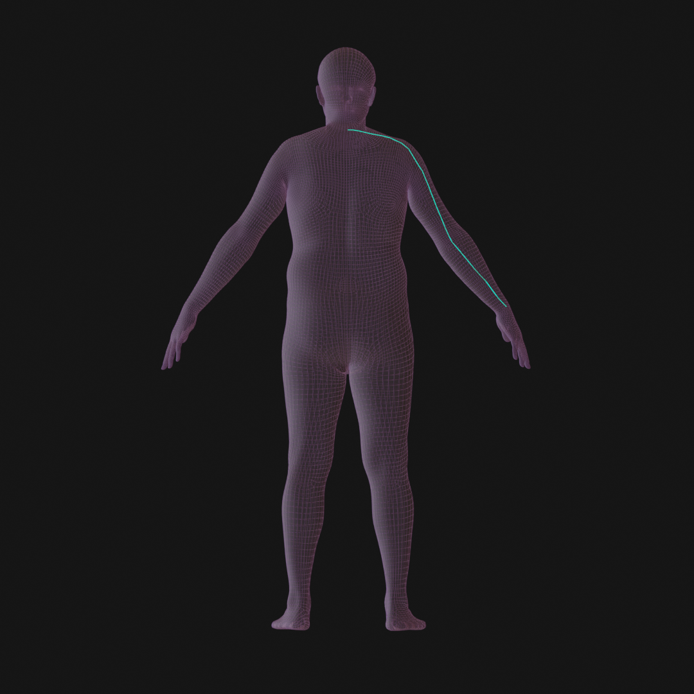
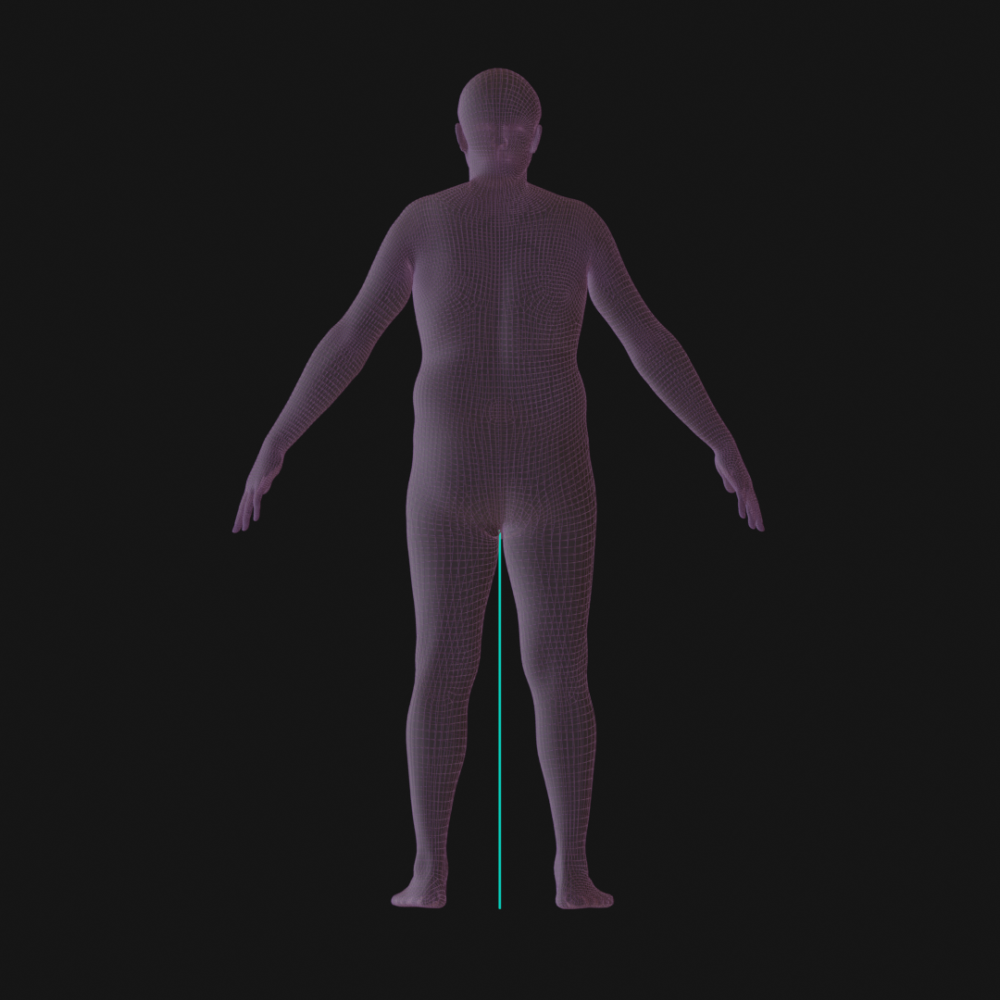

# digidoppel

[digidoppel](https://digidoppel.com/) is our online platform which allows users to convert different kinds of inputs into realistic animation-ready 3D avatars. Users can use 3D scans or body measurements (more options for avatars from mocap, images & video coming soon!)

## Avatars from Scans
On digidoppel, you can create an avatar using 3D scans. 

### Input files and mesh sizes
The platform accepts OBJ and PLY files as input. At the moment only static 3D scans can be processed automatically on the digidoppel platform, for 4D scans, please contact us at [support@meshcapade.com](mailto:support@meshcapade.com) with a small sample of your 4D data. 

We limit the input mesh size to under 1million vertices so please make sure your input file does not have more than 1M veritces when you upload the scan.

### Scans with textures
The digidoppel platform can automatically transfer the texture from a scan to the output we create. You can upload a scan with texture as a zipped file. Make sure the zipped file contains ONLY the scan and texture image file (there should be no hidden files in the zip archive).

The output created will include the processed mesh (in OBJ, FBX, etc. format you choose) + a texture file transformed to our body topology.

### Problems with Internal Geometry

The scan alignment process is designed to work with 3D meshes acquired through 3D scanning process. 

Scans from a 3D scanner can be noisy, this noise is expected and our scan alignment process can handle these. 

However, the 3D scans are expected to only contain an outer surface of the body, and no internal surfaces. Generally when artists create 3D body models in some 3D animation program, they might create additional geometry on the inside of the body surface, e.g.
An artist might create internal geometry for eyes and mouth for the face, as shown below:

Or there the limbs and neck joints might be created as separate geometry objects, so they will have additional geometry where the limb closes off in the 3D model. 
These internal geometry pieces have to be removed before they can be sent for processing on digidoppel.

### Problems with long hair

Input meshes with hair occluding the neck will not function well. Please make sure that hair is not falling onto the shoulders. It is best if it is tied up in a bun or in a haircap.

### Problems with loose clothing

Input meshes with clothing do function, but the tighter the clothing is, the better. Loose clothing or accessories may cause alignment to fail, take a very long time, or produce subpar results. Keep in mind that the training data was done on with models in tight-fitted clothing.

## Avatars from measurements
On digidoppel, you can create an avatar using body measurements. Below is a list of body measurements that are currently available for use on the digidoppel platform:

### Measurements descriptions

| **Measurement**                 | **Description**                                       | **Preview** |
|---------------------------      |-------------------------------------------------------|-------------|
| Height                          | The line segment to the lowest center point to the highest on the mesh. |   |
| Chest circumference at maximum  | The loop resulting from slicing a torso mesh segment transversally at a fixed "nipple level" vertex. |   |
| Shoulder Breadth                | The length of the greatest extents within a defined "shoulder geometry" set of vertices from the sagittal axis. |   |
| Neck circumference at base      | The loop segment of edges across the cervicale landmark at the juncture of the neck and the shoulders of the mesh. |  |
| Arm length (spine to wrist)     | The line segment of edges of the mesh measured from cervicale through acromion to the wrist at the ulnar styloid landmark. |  |
| Arm length (shoulder to wrist)  | The line segment of edges of the mesh measured by subtracting spine-shoulder length measurement from spine-wrist length measurement. |  |
| Arm length (shoulder to elbow)  | The line segment of edges of the mesh measured by subtracting the spine-shoulder length measurement from the spine-elbow length measurement. |  |
| Arm circumference at scye       | The loop resulting from slicing an arm segment with a sagittal plane at a fixed vertex for armpit. |  |
| Waist Circumference       | Given the range of vertice roughly representing the region at and below the navel and above the hip bone, slice the mesh transversally at each of those specified points, and pick the SMALLEST slice for the waist measurement. |  |
| Waist Height              | The length from the bottom of the mesh up to the height of the waist circumference measurement. |  |
| Hip circumference               | Given a range of vertices roughly representing the region at and below the navel and above the hip bone, slice the mesh transversally at each of those specified points, and pick the LARGEST slice for the hip measurement. |  |
| Hip Height                      | The length from the bottom of the mesh up to the height of the hip circumference measurement. |  |
| Thigh Circumference       | Given a range of fixed thigh vertices, transversally slice the mesh at these locations and use the LARGEST slice. |  |
| Inseam                          | The height measured from the bottom of the mesh to a specified crotch vertex. |  |
| Crotch length                   | The line segment of vertices from top of navel, down along a sagittal segment to the opposing side. |  |
| Foot Length                     | A line segment from the rearmost vertex on the foot to the foremost. |  |
| Ankle circumference             | The loop resulting from slicing a leg segment with a transverse plane at a fixed vertex for ankle. |  |

## Digidoppel FAQs

> What exactly is the API?

The API is a digital human cloud platform for creating animation-ready avatars from scans, hand-measurements, and more. You can find out more details about it [here](https://meshcapade.com/infopages/api.html).

> How can I license the API?

We offer different pricing options and packages for the API. For more information, please check our licensing page here. If you have higher volumes of data, please contact us on info@meshcapade.com.

> What am I allowed to do with the generated avatars? Can I share it with my users?

The output files are free for all uses under SMPL Body license, please contact us on info@meshcapade.com.

> How is security being handled for the API?

You can review our Privacy Policy [here](https://info.meshcapade.com/faqs/api-privacy-policy).

> Is your API available as an offline solution/SDK?

Yes. Contact us at info@meshcapade.com.

> Is your API available on a mobile application?

Yes. Contact us at info@meshcapade.com.

> Is there a trial for the API?

When you choose the pay as you go option, you receive 10 Free credits on initial sign up that you can use to try out the API.

> Is there a sample output for the API?

Yes, we have some sample outputs for our bodies-from-scans and bodies-from-measurements API. Please  contact us on info@meshcapade.com to share these sample files with you.

